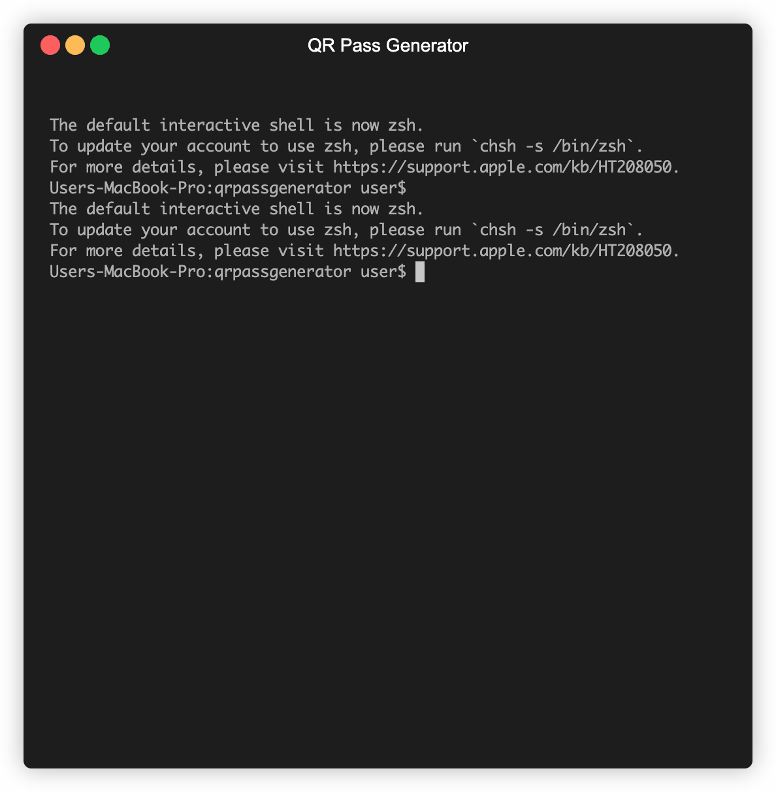

<div align="center">
  
</div>

# 🚀 QR Pass Generator
[](https://nodejs.org/)
[](LICENSE)
[](https://prettier.io/)
[](https://nodejs.org/api/esm.html)

<div align="center">
  <h3>👨‍💻 Sobre o Desenvolvedor</h3>
  <p>
    <strong>Gabriel Henrique</strong> | Desenvolvedor Full Stack com mais de 8 anos de experiência.
  </p>
  <p>
    <a href="https://www.linkedin.com/in/gabriel-henrique-103529366" target="_blank" rel="noopener noreferrer">
      
    </a>
  </p>
  <p align="left" style="max-width: 600px;">
    Com uma sólida trajetória em sistemas comerciais (PHP, Node.js), meu foco é otimizar processos e reduzir custos de infraestrutura através de aplicações eficientes. Atualmente, dedico-me ao ecossistema JavaScript, com conhecimento em React e especialização em responsividade.
    <br /><br />
    Atuo como um <strong>concierge de regras de negócio</strong>, traduzindo as necessidades do cliente em soluções técnicas robustas, e sou especialista em bancos de dados relacionais e não relacionais.
  </p>
</div>

## 📋 Sobre o Projeto
O **QR Pass Generator** é um gerador de utilidades avançado com interface CLI moderna e robusta desenvolvida em Node.js que combina duas funcionalidades úteis para produtividade e segurança: **geração de QR Codes personalizados** e **criação de senhas customizadas** com critérios específicos.


<div align="center">
  🎬 Demonstração
  <br />
  
  
  *GIF criado com [Terminalizer](https://terminalizer.com/) | Logo criado com [Google AI Studio](https://aistudio.google.com/)*
</div>


## 🎯 Aplicações Práticas

A ferramenta é versátil e pode ser usada em diversos cenários:

#### Para Geração de QR Codes
- **Marketing e Divulgação:** Crie QR Codes para campanhas publicitárias, links de produtos em e-commerce ou para direcionar usuários a perfis de redes sociais.
- **Materiais Impressos:** Adicione QR Codes em cartões de visita, flyers e banners para conectar o mundo físico ao digital.
- **Uso Pessoal e Corporativo:** Facilite o compartilhamento de redes Wi-Fi, contatos (vCards) ou links para portfólios.

#### Para Geração de Senhas
- **Segurança Pessoal:** Gere senhas fortes e únicas para proteger suas contas online no dia a dia.
- **Acesso a Sistemas:** Crie senhas temporárias para eventos corporativos, sistemas de check-in ou acesso a plataformas internas.
- **Rastreamento de Campanhas:** Gere códigos únicos para rastrear conversões e engajamento em ações de marketing.


## ✨ Funcionalidades

- 🔐 **Gerador de QR Codes** - Criação rápida e personalizada de códigos QR
- 🎯 **Gerador de Senhas Customizadas** - Senhas seguras com critérios personalizáveis
- 🎨 **Interface CLI Moderna** - Terminal colorido e interativo com prompts avançados
- 🔄 **Loop Integrado** - Aplicação contínua sem interrupções
- 🏗️ **Arquitetura Strategy** - Padrão de design implementado para escalabilidade
- 🌍 **Suporte Multi-idioma** - Mensagens em português para melhor experiência

## 🛠️ Tecnologias Utilizadas

| Categoria | Tecnologia | Versão | Propósito |
|-----------|------------|---------|-----------|
| **Runtime** | Node.js | 18+ | Ambiente de execução JavaScript |
| **CLI Framework** | `prompts` | Fork customizado | Interface de usuário interativa |
| **Styling** | `kleur` | 4.1.5 | Cores e formatação no terminal |
| **QR Code** | `qrcode` | 1.5.4 | Geração de códigos QR |
| **Code Quality** | Prettier | 3.6.2 | Formatação automática de código |

##  Como Executar

### Pré-requisitos
- Node.js 18+ instalado
- NPM ou Yarn como gerenciador de pacotes

### Instalação
```bash
# 1. Clone o repositório
git clone https://github.com/10envolvedor/qrpassgenerator
cd qrpassgenerator

# Instale as dependências
npm install --production

# Configure as variáveis de ambiente (opcional)
cp .env.example .env
```

### Execução
```bash
# Iniciar em modo desenvolvimento (com watch)
npm start

# Ou executar diretamente
node --watch --env-file=.env src/server.js

# Formatar código
npm run format

# Verificar formatação
npm run format:check
```

## 🏗️ Arquitetura

### Padrão Strategy Implementado
O projeto utiliza o padrão de design **Strategy** para gerenciar diferentes funcionalidades:

```javascript
let estrategias = [
  manipularProcesso.sair, // Estratégia 0: Sair
  manipularQRCode,           // Estratégia 1: QR Code
  manipularSenhaCustomizada, // Estratégia 2: Senhas
];
```

### Estrutura de Diretórios
```
src/
├── promptsSchema/          # Schemas de prompts interativos
│   ├── main.js            # Menu principal
│   ├── QRCode.js          # Configurações de QR
│   └── senhaCustomizada.js # Configurações de senha
├── services/               # Lógica de negócio
│   ├── QRCode/            # Serviços de QR Code
│   │   ├── gerar.js       # Geração de QR
│   │   ├── manipular.js   # Manipulação de dados
│   │   └── utils/         # Utilitários
│   └── senhaCustomizada/  # Serviços de senha
│       ├── gerar.js       # Geração de senhas
│       ├── manipular.js   # Manipulação de dados
│       └── utils/         # Utilitários
└── server.js              # Ponto de entrada da aplicação
```

## 🎓 Conceitos Praticados

Este projeto foi uma oportunidade para aplicar e aprofundar conhecimentos em diversas áreas do desenvolvimento de software:

### 🏗️ Arquitetura e Design de Software
- **Padrão de Projeto Strategy:** Utilizado para desacoplar os algoritmos das funcionalidades principais (QR Code e Senha), permitindo que novas estratégias sejam adicionadas facilmente.
- **Arquitetura em Camadas:** Separação clara de responsabilidades entre a interface (CLI), serviços (lógica de negócio) e utilitários.
- **Módulos ESM:** Uso do sistema de módulos do ECMAScript para um código mais moderno, organizado e manutenível.
- **Variáveis de Ambiente:** Configuração segura e flexível da aplicação utilizando o arquivo `.env`.

### 🔒 Segurança
- **Validação de Entradas (Input Validation):** Tratamento rigoroso dos dados fornecidos pelo usuário para prevenir falhas e comportamentos inesperados.
- **Limites de Segurança:** Controle sobre o tamanho máximo de dados (ex: 1000 caracteres para senhas) para mitigar riscos de ataques de negação de serviço (DoS).
- **Geração Segura de QR Code:** Validação do tamanho máximo de dados (2953 bytes) para garantir a integridade do código gerado.
- **Logging Seguro:** Implementação de logs que não expõem dados sensíveis do usuário, protegendo a privacidade.

### ⚡ Programação Assíncrona
- **`async/await`:** Gerenciamento moderno e legível de operações de I/O, como a interação com o terminal.
- **Tratamento de Erros:** Uso de blocos `try/catch` para capturar e tratar exceções de forma robusta, garantindo a estabilidade da aplicação.

### 💻 Desenvolvimento de CLI e UX
- **Interface de Linha de Comando (CLI):** Criação de uma experiência de usuário interativa e guiada com o `prompts`.
- **Feedback Visual:** Uso da biblioteca `kleur` para fornecer respostas coloridas e intuitivas, melhorando a usabilidade no terminal.
- **Navegação e Usabilidade (UX/UI):** Foco em um fluxo de navegação claro e em mensagens que guiam o usuário, desde o menu principal até a conclusão das tarefas.
- **README Responsivo:** Uso de técnicas como `clamp()` e unidades `dvw` para garantir que o conteúdo visual (como o GIF de demonstração) se adapte a diferentes tamanhos de tela, melhorando a experiência de leitura.

### 🧹 Clean Code e Boas Práticas
- **Nomenclatura Descritiva:** Uso de nomes de variáveis, funções e arquivos que expressam claramente sua intenção e propósito.
- **Funções Pequenas e Focadas:** Cada função tem uma única responsabilidade, facilitando a leitura, teste e manutenção.
- **Comentários Significativos:** Documentação apenas onde necessário, explicando o "porquê" e não o "como" do código.
- **Tratamento de Erros Consistente:** Padronização na captura e tratamento de exceções, com mensagens de erro claras e úteis.
- **Estrutura de Diretórios Organizada:** Separação lógica de arquivos por responsabilidade (schemas, services, utils).
- **Validação de Entrada:** Verificação rigorosa de parâmetros em todas as funções públicas para garantir robustez.
- **Código Autoexplicativo:** Priorização de código que se explica sozinho, reduzindo a necessidade de comentários desnecessários.
- **Controle de Versão (Git):** Aplicação de práticas de versionamento com Git, incluindo o uso de `.gitignore` para gerenciar arquivos, commits atômicos e tags para versionamento de releases.

#### 🎯 Princípios Fundamentais
- **SOLID Principles:**
  - **S (Single Responsibility):** Cada módulo tem uma única responsabilidade (QR Code, Senha, Processo)
  - **O (Open/Closed):** Sistema extensível via Strategy Pattern sem modificar código existente
  - **L (Liskov Substitution):** Estratégias são intercambiáveis mantendo o mesmo comportamento
  - **I (Interface Segregation):** Interfaces específicas para cada funcionalidade
  - **D (Dependency Inversion):** Dependências abstraídas através de funções e módulos
- **DRY (Don't Repeat Yourself):** Reutilização de código através de utilitários e configurações padrão
- **KISS (Keep It Simple, Stupid):** Soluções simples e diretas, evitando complexidade desnecessária

### 🎯 Próximos Passos

#### 🧪 Estratégias de Teste
- **Node.js Test Runner** - Implementação de testes nativos usando `node:test`
- **Vitest** - Configuração de ambiente de testes moderno e rápido

#### 🚀 Funcionalidades Futuras
- **Upload de Arquivos** - Funcionalidade para processamento e geração de QR Codes a partir de arquivos
- **Interface Web:** Desenvolvimento de uma interface com React para melhorar a experiência do usuário.
- **Opções Avançadas de QR Code:**
  - Adicionar um ícone ou logo no centro do QR Code.
  - Permitir o download do QR Code como imagem (PNG, SVG).
  - Gerar QR Codes a partir de upload de arquivos.
- **Calculadora de Força de Senha:**
  - Análise de complexidade (entropia, diversidade de caracteres) em tempo real.
  - Score de segurança mínimo aceitável para novas senhas.

### 🎨 Qualidade de Código
- **Prettier**: Formatação automática para consistência
- **ESM**: Módulos ES6 para código moderno
- **Arquitetura Limpa**: Separação clara de responsabilidades
- **Padrões de Design**: Implementação do Strategy Pattern
- 
#### 🌍 Internacionalização (i18n)
- **Tradução:** O fork customizado do `prompts` que fiz implementou tradução de mensagens para português.
- **Contribuição:** Existe a possibilidade de enviar um Pull Request para o repositório original, contribuindo com a comunidade open source oferencendo multi-idiomas.

##  Dificuldades e Resoluções

### 🔍 Desafios Enfrentados
1. **Mensagens em Inglês**: Identificação de textos não localizados
2. **Encerramento Abrupto**: Terminal fechando sem controle do usuário
3. **Arquitetura Monolítica**: Necessidade de refatoração para escalabilidade

### ✅ Soluções Implementadas
1. **Fork e Tradução**: Criação de versão localizada com planos de contribuição
2. **Loop Integrado**: Sistema de menu contínuo com opção de saída
3. **Padrão Strategy**: Arquitetura modular e extensível

## 🔗 Links Úteis

- **Repositório Original**: [prompts](https://github.com/terkelg/prompts)
- **Fork Traduzido**: [10envolvedor/prompts](https://github.com/10envolvedor/prompts)
- **Documentação QR Code**: [qrcode](https://github.com/soldair/node-qrcode)
- **Prettier**: [prettier.io](https://prettier.io/)

## 🙏 Agradecimentos

### 💻 Projeto Original
Este projeto foi inspirado no trabalho da **Digital Innovation One (DIO)**:
- **Repositório Original**: [formacao-nodejs/projeto-qrcode](https://github.com/digitalinnovationone/formacao-nodejs/tree/main/projeto-qrcode)
- **Felipe** da DIO - Inspiração e motivação para retomar a programação
- **Comunidade Open Source** - Pacotes e ferramentas utilizadas

### 💪 Reanimação da Programação
Este projeto representa um marco importante na retomada da paixão pela programação, demonstrando:
- **Persistência** na resolução de problemas
- **Aprendizado contínuo** de novas tecnologias
- **Contribuição** para a comunidade open source
- **Arquitetura profissional** com padrões de design

## 📝 Licença

Este projeto está licenciado sob a licença ISC. Veja o arquivo [LICENSE](LICENSE) para mais detalhes.

---

**Desenvolvido com ❤️ e ☕ por um desenvolvedor apaixonado por código limpo e arquitetura robusta.**

> *"O código é poesia, e a arquitetura é a arte de organizar essa poesia."*
